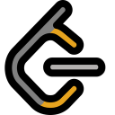

<hr>


**A cross-browser extension to improve :rocket: productivity on 
<a href="https://leetcode.com" target="_blank">Leetcode</a>**.

It is a light-weight browser extension which runs in the menu bar. It boosts your productivity by hiding unnecessary visual elements from the screen, enabling you to focus on what is important. You can change your preferences form the popup menu and find out what best suits your needs.

## :heavy_check_mark: Features
* Hide locked problems from the table
* Hide / Show any table column (including Difficulty, Acceptance, etc)
* Highlight solved problems
* Hide Difficulty count

**Note**: The extension functions on the following URLs :
* https://leetcode.com/problemset/all/* (old and new UI)
* https://leetcode.com/tag/*
* https://leetcode.com/problems/* 

## Input the question number or question name to go to the search from any site
## :star2: Installation

Clone the source code locally:

```sh
$ git clone https://github.com/bhomiksingh2000/Leetcode_Ext.git
$ cd leetcode-enhancer
```
### Google Chrome
* Go to `chrome://extensions/` and enable `Developer mode`
* Click on `load unpacked` and select the folder containing `manifest.json` file
* Pin this extension to use it.

### Mozilla Firefox
* Go to `about:debugging` and click on `This Firefox` (if you are not already there)
* Click on `Load Temporary Add-on...` and select the `manifest.json` file
* The addon will appear next to the address bar only when you are on leetcode

### Microsoft Edge
* follow steps in this [link](https://www.windowscentral.com/how-install-non-store-extensions-microsoft-edge)

## :handshake: Contribution
Contributions are always welcomed, here is what you need to do:
1. Work on an existing issue or create a new one [here](https://github.com/bhomiksingh2000/Leetcode_Ext/issues)
2. Create a pull request linked to that issue

Know more about [pull request](https://docs.github.com/en/free-pro-team@latest/github/collaborating-with-issues-and-pull-requests/about-pull-requests).
## :earth_asia: Development Env Tools
* Mozilla Firefox 83.0
* Google Chrome 87.0


## :clipboard: License
MIT © <a href = "(https://www.linkedin.com/in/bhomik-singh-a8a69b202/)" target="_blank">Bhomik Singh</a>
